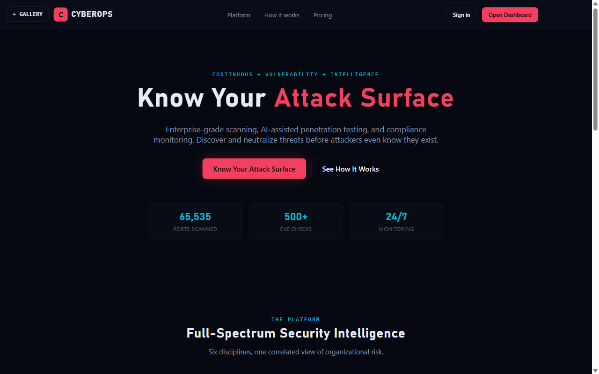

# CyberOps

**One correlated view of organizational risk, with the audit trail to prove it.**

[&#9654; Live preview](https://mdlcai.github.io/ai-mdlc-kernel-examples/cyberops/index.html) · [System architecture](https://mdlcai.github.io/ai-mdlc-kernel-examples/cyberops/architecture.html) · [Build with MDLC &rarr;](https://mdlc.ai)

> One of eleven reference apps built end-to-end with the **[MDLC](https://mdlc.ai)** methodology, from a `RESEARCH.md` blueprint, through architecture and build, to a passing set of quality gates. Nothing here was hand-tuned after generation.

## What it does

CyberOps is a multi-tenant security operations platform for teams that run **authorized** testing against infrastructure they own:

- **Assets and authorization scope.** Register domains, IPs, CIDRs, URLs, and repos; prove ownership (DNS TXT or audited manual attestation) before any scan may touch a target. Deny by default.
- **Scanning.** A pluggable adapter engine with safe built-in reconnaissance (DNS records, HTTP fingerprinting, TLS inspection) and a Nuclei-style signature corpus; Nuclei and Trivy adapters when the binaries are present. Scans run in BullMQ workers and stream progress over WebSocket.
- **Findings.** CVSS/CWE-tagged findings correlated across scans, validation and retest state, and a remediation timeline.
- **AI-assisted pentest planning.** A planner proposes attack paths from findings; anything beyond safe validation stops at a **human approval gate**. No live exploitation is modeled (`DECISIONS.md` ADR-005).
- **OSINT.** Indicator investigation (domain, IP, hash, email) correlated against your assets and threat feeds, with a risk score.
- **Compliance.** SOC 2, PCI DSS, and OWASP control mappings with a posture grade and exportable PDF/JSON/CSV reports.
- **Operations.** Append-only hash-chained audit log, transactional outbox for email and signed outbound webhooks, signature-verified inbound webhooks.

## Stack

- **API:** NestJS 11 · REST `/v1` · TypeORM · PostgreSQL 18 (row-level security as defense in depth)
- **Web:** Next.js 15 (App Router) · Tailwind · TanStack Query, on design tokens copied verbatim from the uploaded design template
- **Async / realtime:** Redis · BullMQ · Socket.io with the Redis adapter
- **Contracts:** `packages/shared` (Zod schemas shared by API and web)
- **Deploy:** Docker Compose (api, web, postgres, redis), HTTPS-only in production

## Security

The **independent Reviewer Gate failed the first pass**: `assertResourceAccess`, the object-level authorization check, was defined and unit-tested but never called from any controller or service, leaving every owner-bearing resource open to intra-tenant IDOR. The build re-entered Stage 3; the fix was wired into every owner-bearing path and a new machine-checked invariant (INV-15) now fails the lint if the call site ever disappears. Re-review found two more holes (report download, pentest approval), then a third (pentest create). Pass 4: PASS. The whole sequence is in [`REPORT.md`](./REPORT.md).

The Security Audit Gate closed **PASS WITH ADVISORY**: two base-HIGH advisories in Next 15's vendored build-time dependencies (postcss, sharp) are not reachable from this app's runtime surface, are accepted, and are tracked to the Next 16 upgrade. Full detail in [`SECURITY-AUDIT.md`](./SECURITY-AUDIT.md).

## Evidence pack

| File | What it is |
|---|---|
| [`RESEARCH.md`](./RESEARCH.md) | The blueprint the build was generated from |
| [`ARCHITECTURE.md`](./ARCHITECTURE.md) | System design, threat model, and the 15 architectural invariants |
| [`SPEC.md`](./SPEC.md) | The behavioral contract: data model, API surface, state machines, workflows |
| [`DECISIONS.md`](./DECISIONS.md) | ADRs, including the safety boundary and the ownership model |
| [`REPORT.md`](./REPORT.md) | Every gate, every round, every result |
| [`SECURITY-AUDIT.md`](./SECURITY-AUDIT.md) | Three-pass security audit and dispositions |
| [`COMPLIANCE.md`](./COMPLIANCE.md) | SPEC security requirements mapped to code |

**Gates:** typecheck 0 · lint 0 · 29 tests · 15/15 invariants · Reviewer PASS (4 rounds) · Security PASS WITH ADVISORY · 17/17 functional smoke · 5/5 Playwright e2e against the containerized stack.

---

Built with **[MDLC](https://mdlc.ai)**. Learn more at [mdlc.ai](https://mdlc.ai).
