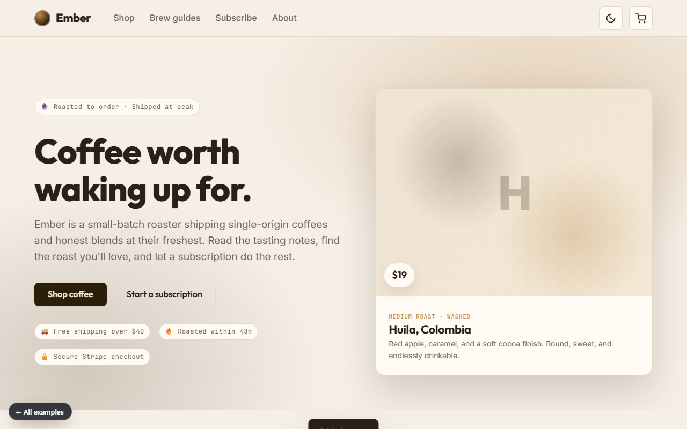

# Ember

**Single-origin coffee, roasted to order — a direct-to-consumer storefront.**

[▶ Live preview](https://mdlcai.github.io/ai-mdlc-kernel-examples/ember/index.html) · [System architecture](https://mdlcai.github.io/ai-mdlc-kernel-examples/ember/architecture.html) · [Build with MDLC →](https://mdlc.ai)

> One of eight reference apps built end-to-end with the **[MDLC](https://mdlc.ai)** methodology — from a `RESEARCH.md` blueprint, through architecture and build, to a passing set of quality gates. Nothing here was hand-tuned after generation.

## What it does

A specialty coffee roaster's online store: customers browse a catalog of single-origin and blend coffees, read tasting notes and brew guides, add bags to a cart, and check out securely with Stripe — with an optional subscription that ships a favorite roast on a schedule. It replaces the slow, generic template storefronts most small roasters run with a fast, beautiful shop they fully own.

## Built from a blueprint

Every file below was generated in sequence. Read them in order to see the methodology work:

| Stage | Artifact | What it is |
|-------|----------|------------|
| 1 · Research | [`RESEARCH.md`](RESEARCH.md) | Product vision, users, threat model, GO/NO-GO |
| 2 · Architecture | [`ARCHITECTURE.md`](ARCHITECTURE.md) · [`architecture.html`](https://mdlcai.github.io/ai-mdlc-kernel-examples/ember/architecture.html) | System design, data flow, layer-by-layer |
| 3 · Contract | [`SPEC.md`](SPEC.md) · [`DECISIONS.md`](DECISIONS.md) | API surface + the ADRs behind every choice |
| 4 · Assurance | [`COMPLIANCE.md`](COMPLIANCE.md) · [`SECURITY-AUDIT.md`](SECURITY-AUDIT.md) | Controls mapping (PCI-aware checkout) + security review |
| 5 · Build report | [`REPORT.md`](REPORT.md) | Every gate that ran, with evidence |

## The gates it passed

Straight from [`REPORT.md`](REPORT.md):

- **39** tests green (incl. concurrency tests — racing checkout, **no overselling**)
- **23** functional smoke flows PASS
- **12** machine-checked invariants
- Clean `typecheck` · `lint` · `build` · invariant-lint — all exit 0

## Stack

`Next.js 16 App Router` · `Express 5` · `Postgres` · `REST` · `Stripe`
Domain signals: `has_payments` · `has_image_uploads` · `has_webhooks`

---

*This folder ships the standalone preview + the build's evidence pack. The runnable application source lives in the build, not here.* **[mdlc.ai](https://mdlc.ai)**
