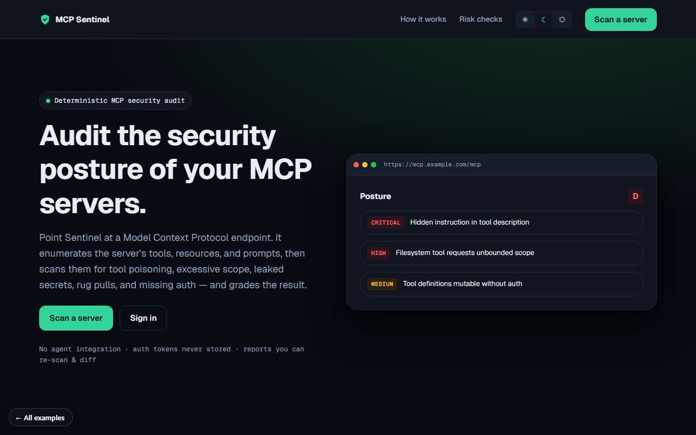

# MCP Sentinel

**Audit the security posture of your MCP servers.**

[▶ Live preview](https://mdlcai.github.io/ai-mdlc-kernel-examples/mcpsentinel/index.html) · [System architecture](https://mdlcai.github.io/ai-mdlc-kernel-examples/mcpsentinel/architecture.html) · [Build with MDLC →](https://mdlc.ai)

> One of ten reference apps built end-to-end with the **[MDLC](https://mdlc.ai)** methodology — from a `RESEARCH.md` blueprint, through architecture and build, to a passing set of quality gates. Nothing here was hand-tuned after generation.

## What it does

Point Sentinel at a Model Context Protocol endpoint. It enumerates the server's tools, resources, and prompts, then scans for **tool poisoning, excessive scope, leaked secrets, rug pulls, and missing auth** — and grades the result A–F. The scan path is deterministic: real entropy/hash-diff/hidden-Unicode detection, no LLM in the loop.

## Built from a blueprint

Every file below was generated in sequence. Read them in order to see the methodology work:

| Stage | Artifact | What it is |
|-------|----------|------------|
| 1 · Research | [`RESEARCH.md`](RESEARCH.md) | Product vision, users, threat model, GO/NO-GO |
| 2 · Architecture | [`ARCHITECTURE.md`](ARCHITECTURE.md) · [`architecture.html`](https://mdlcai.github.io/ai-mdlc-kernel-examples/mcpsentinel/architecture.html) | System design, data flow, layer-by-layer |
| 3 · Contract | [`SPEC.md`](SPEC.md) · [`DECISIONS.md`](DECISIONS.md) | API surface + the ADRs behind every choice |
| 4 · Assurance | [`COMPLIANCE.md`](COMPLIANCE.md) · [`SECURITY-AUDIT.md`](SECURITY-AUDIT.md) | OWASP mapping + security review |
| 5 · Build report | [`REPORT.md`](REPORT.md) · [`SMOKE-TEST.md`](SMOKE-TEST.md) | Every gate that ran + the functional smoke matrix |

## The gates it passed

Straight from [`REPORT.md`](REPORT.md):

- **37 / 37** unit + integration tests green
- **17 / 17** end-to-end smoke flows PASS
- **10 / 10** machine-checked invariants (SSRF, tenant isolation, CSRF, rate-limit, ReDoS-safe)
- **Reviewer Gate: PASS** — independent fresh-context review found no correctness-class failures

## Stack

`React 18 + Vite` · `Hono on Node` · `Postgres + Drizzle` · `REST` · `Docker Compose`
Domain signals: `has_webhooks`

---

*This folder ships the standalone preview + the build's evidence pack. The runnable application source lives in the build, not here.* **[mdlc.ai](https://mdlc.ai)**
