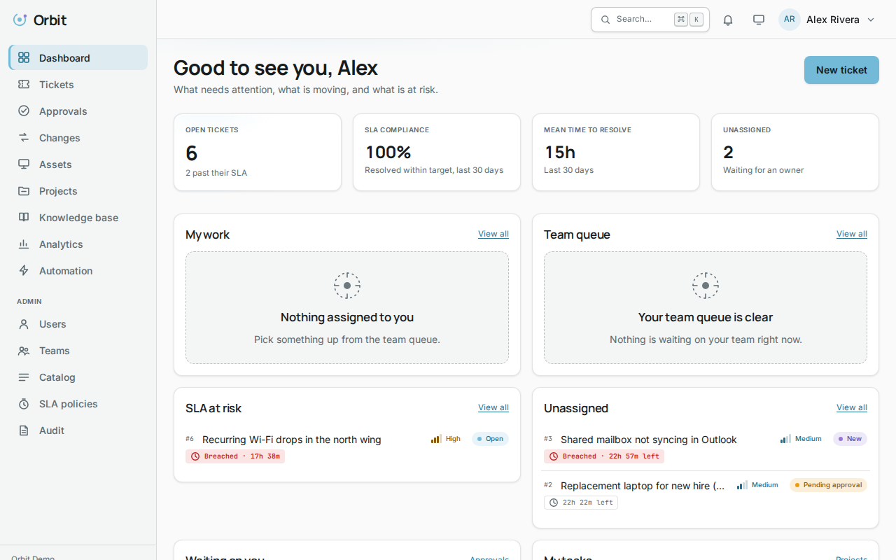

# Orbit

**One place for tickets, changes, assets, projects and the automation between them, with the audit trail to prove what happened.**

[▶ Screen atlas](https://mdlcai.github.io/ai-mdlc-kernel-examples/orbit/index.html) · [Architecture](https://mdlcai.github.io/ai-mdlc-kernel-examples/orbit/architecture.html) · [Build report](REPORT.md)

> The largest build in this gallery: **28 screens**, each rendered and measured at 375, 768 and 1280 pixels in both light and dark themes. One of the reference apps built end-to-end with the **[MDLC](https://mdlc.ai)** methodology.

## What it does

Orbit is a multi-tenant IT service management platform:

- **Tickets.** A queue with saved filters, SLA timers, breach escalation, and a full comment and audit history.
- **Changes.** Change requests with risk classification, approval chains, scheduling windows, and implementation and rollback plans.
- **Assets.** Inventory with ownership, assignment history, and links to the tickets and changes that touched them.
- **Projects.** Milestones and tasks, with progress rolled up from the work underneath.
- **Knowledge base.** Articles with search that falls back to the closest matches rather than returning nothing.
- **Automation.** Rules evaluated on a schedule against seven trigger types, with the actions they take recorded in the audit trail.
- **Audit trail.** Append-only, filterable, CSV-exportable, and verifiable — the application cannot rewrite it.

Next.js and Express on PostgreSQL, server-side sessions with Argon2id, deployed as a Docker Compose stack behind Caddy.

## What the gates caught

The evidence pack is the point of this folder. The highlights, all recorded in [`REPORT.md`](REPORT.md) and [`DECISIONS.md`](DECISIONS.md):

- **Scheduled automation rules were a silent no-op.** The job wrote a `lastRunAt` timestamp without evaluating any rule condition or applying any action, and the interface rendered that timestamp as a successful run. Green everywhere, working nowhere.
- **The automation dispatcher was wired to one trigger of seven.** The other six read as complete and were dead code.
- **The dashboard leaked org-wide figures** to a role that the analytics endpoint correctly withheld them from. The interface hid the numbers; the API still sent them.
- **Audit pagination could skip or repeat rows** — it ordered by `(created_at, id)` while its cursor filtered on `id` alone. This was also the cause of the test suite's intermittent failures; the flaky test was catching a real bug.
- **An invariant that could never fail.** One machine check ordered two terms, one of which never appeared in the file it searched. It was found by deliberately breaking the property to confirm the check went red.

Each of those passed the type checker, the linter, and its own tests. None would have been visible to a reviewer skimming the code.

## Honest posture

This build shipped with recorded residuals rather than a clean sweep, and the report says so:

- The Reviewer Gate returned **FAIL, FAIL, then ADVISORY** across three rounds. Each round found real defects, listed above.
- The Design Quality Gate finished with **⚠ verdicts standing** on several screens, each named with its cause in [`DESIGN-NOTES`](REPORT.md).
- Load testing met its targets below saturation and **missed them under it**, against a data set far smaller than the spec's.
- A Lighthouse SEO score of 63 on the dashboard is **carried as a residual, not fixed**: the screen is `noindex` because it is authenticated, and Lighthouse penalises exactly that. Removing the control to raise the score would have been a regression, so it was documented instead.

## The files

| File | What it proves |
|------|----------------|
| [`RESEARCH.md`](RESEARCH.md) | The blueprint — vision, users, workflows, and 127 cited sources |
| [`ARCHITECTURE.md`](ARCHITECTURE.md) + [`architecture.html`](architecture.html) | System design, data model, and the invariants the gates enforce |
| [`SPEC.md`](SPEC.md) | The API surface, screens and workflows the build was held to |
| [`DECISIONS.md`](DECISIONS.md) | Every ADR, including the ones that refused a change |
| [`COMPLIANCE.md`](COMPLIANCE.md) | Controls mapped to the code and tests that implement them |
| [`SECURITY-AUDIT.md`](SECURITY-AUDIT.md) | The independent security review and its remediations |
| [`SMOKE-TEST.md`](SMOKE-TEST.md) | Key workflows exercised against the running deploy |
| [`REPORT.md`](REPORT.md) | **Every gate that ran, with evidence.** Start here |
| [`index.html`](index.html) | The screen atlas: all 28 screens, four renderings each |

The runnable application source isn't checked in — this folder is the showcase and the receipts, not a deployable repo.
