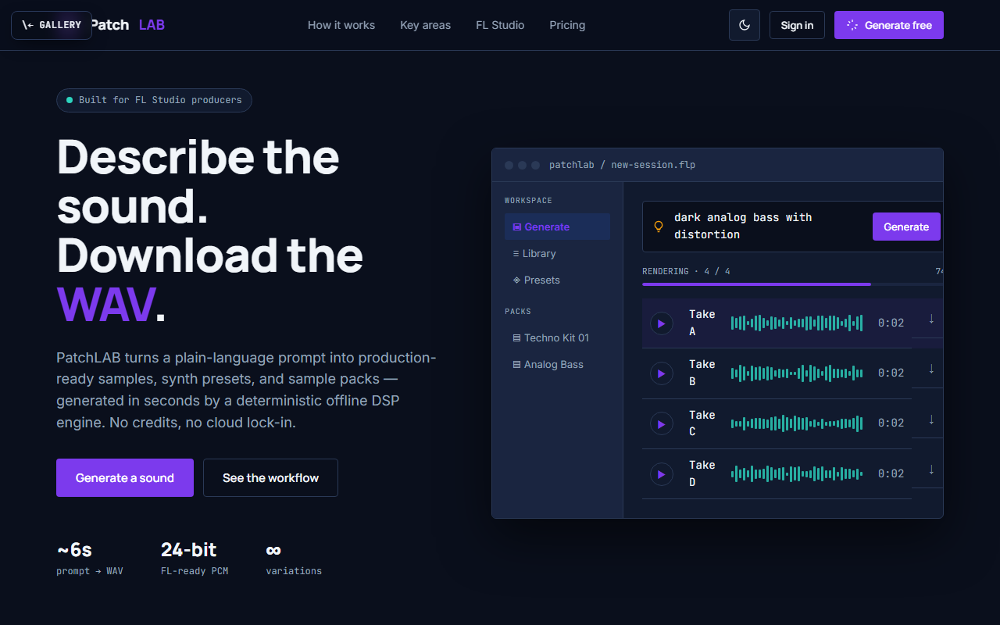

# PatchLAB

**Describe the sound in plain language — download the WAV.**

[▶ Live preview](https://mdlcai.github.io/ai-mdlc-kernel-examples/patchlab/index.html) · [System architecture](https://mdlcai.github.io/ai-mdlc-kernel-examples/patchlab/architecture.html) · [Build with MDLC →](https://mdlc.ai)

> One of ten reference apps built end-to-end with the **[MDLC](https://mdlc.ai)** methodology — from a `RESEARCH.md` blueprint, through architecture and build, to a passing set of quality gates. Nothing here was hand-tuned after generation.

## What it does

PatchLAB turns a plain-language prompt ("deep analog bass," "techno kick") into production-ready WAV samples, loops, synth presets, and ZIP sample packs — generated in seconds by a **deterministic offline DSP engine**, not a cloud model. Purpose-built for FL Studio producers and electronic-music creators who want sounds without credits, latency, or cloud lock-in.

## Built from a blueprint

Every file below was generated in sequence. Read them in order to see the methodology work:

| Stage | Artifact | What it is |
|-------|----------|------------|
| 1 · Research | [`RESEARCH.md`](RESEARCH.md) | Product vision, users, DSP approach, GO/NO-GO |
| 2 · Architecture | [`ARCHITECTURE.md`](ARCHITECTURE.md) · [`architecture.html`](https://mdlcai.github.io/ai-mdlc-kernel-examples/patchlab/architecture.html) | System design, signal flow, layer-by-layer |
| 3 · Contract | [`SPEC.md`](SPEC.md) · [`DECISIONS.md`](DECISIONS.md) | API surface + the ADRs behind every choice |
| 4 · Assurance | [`COMPLIANCE.md`](COMPLIANCE.md) · [`SECURITY-AUDIT.md`](SECURITY-AUDIT.md) | OWASP mapping + 3-pass security review |
| 5 · Build report | [`REPORT.md`](REPORT.md) · [`SMOKE-TEST.md`](SMOKE-TEST.md) | Every gate that ran + the functional smoke matrix |

## The gates it passed

Straight from [`REPORT.md`](REPORT.md):

- **33** backend tests green
- **10 / 10** functional smoke flows PASS (incl. auth, IDOR, large-cookie, over HTTPS)
- **12 / 12** machine-checked invariants (+ 2 manual verified)
- **Security audit: PASS** — 0 critical / 0 high / 0 medium residual (3-pass, [`SECURITY-AUDIT.md`](SECURITY-AUDIT.md))
- Clean sequential verification run — `typecheck` · `build` · invariant-lint all exit 0

## Stack

`Next.js` · `FastAPI` · `PostgreSQL` · `REST` · `Docker Compose`
Engine: deterministic NumPy / `scipy.signal` synthesis — no external model calls.

---

*This folder ships the standalone preview + the build's evidence pack. The runnable application source lives in the build, not here.* **[mdlc.ai](https://mdlc.ai)**
