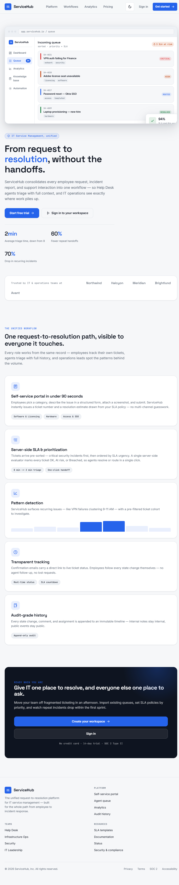

# ServiceHub

**IT service management, unified — requests, incidents, and approvals in one place.**

[▶ Live preview](https://mdlcai.github.io/ai-mdlc-kernel-examples/servicehub/index.html) · [System architecture](https://mdlcai.github.io/ai-mdlc-kernel-examples/servicehub/architecture.html) · [Build with MDLC →](https://mdlc.ai)

> One of eight reference apps built end-to-end with the **[MDLC](https://mdlc.ai)** methodology — from a `RESEARCH.md` blueprint, through architecture and build, to a passing set of quality gates. Nothing here was hand-tuned after generation.

## What it does

A multi-tenant ITSM platform: one place for employee requests, incidents, and approvals — with **automated routing, SLA tracking, and real-time queues**. Replaces the email/chat/spreadsheet sprawl that loses tickets and muddles prioritization. No bloat, no lost requests.

## Built from a blueprint

Every file below was generated in sequence. Read them in order to see the methodology work:

| Stage | Artifact | What it is |
|-------|----------|------------|
| 1 · Research | [`RESEARCH.md`](RESEARCH.md) | Product vision, users, threat model, GO/NO-GO |
| 2 · Architecture | [`ARCHITECTURE.md`](ARCHITECTURE.md) · [`architecture.html`](https://mdlcai.github.io/ai-mdlc-kernel-examples/servicehub/architecture.html) | System design, data flow, layer-by-layer |
| 3 · Contract | [`SPEC.md`](SPEC.md) · [`DECISIONS.md`](DECISIONS.md) | API surface + the ADRs behind every choice |
| 4 · Assurance | [`COMPLIANCE.md`](COMPLIANCE.md) · [`SECURITY-AUDIT.md`](SECURITY-AUDIT.md) | OWASP-aligned controls + 3-pass security audit (object-level authz, multi-tenant isolation) |
| 5 · Build report | [`REPORT.md`](REPORT.md) · [`SMOKE-TEST.md`](SMOKE-TEST.md) | Every gate that ran + the functional smoke matrix |

## The gates it passed

Straight from [`REPORT.md`](REPORT.md):

- **10 / 10** unit + integration tests green
- **27 / 27** end-to-end smoke flows PASS — incl. **same-tenant cross-user + sub-resource + cross-tenant isolation (all 404)**, internal-note confidentiality, and anti-enumeration
- **15 / 15** machine-checked invariants (+ 1 manually audited)
- Security Audit Gate: **0 CRITICAL · 0 HIGH** residual (3-pass: scan → auto-remediate → re-scan)

## Stack

`React + Vite` · `Express on Node` · `Postgres` · `REST` · `Docker Compose`
Domain signals: `has_webhooks` · `has_image_uploads`

---

*This folder ships the standalone preview + the build's evidence pack. The runnable application source lives in the build, not here.* **[mdlc.ai](https://mdlc.ai)**
