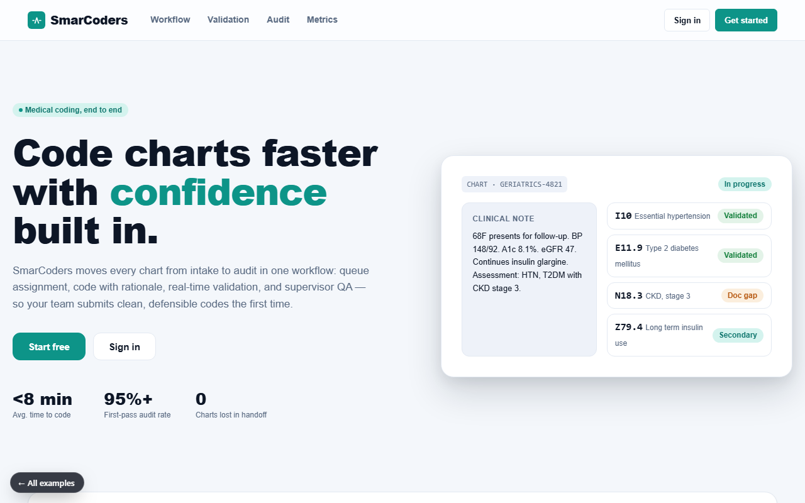

# SmartCoder

**Medical-coding workflow & QA training — on synthetic encounters, never real PHI.**

[▶ Live preview](https://mdlcai.github.io/ai-mdlc-kernel-examples/smartcoder/index.html) · [System architecture](https://mdlcai.github.io/ai-mdlc-kernel-examples/smartcoder/architecture.html) · [Build with MDLC →](https://mdlc.ai)

> One of eight reference apps built end-to-end with the **[MDLC](https://mdlc.ai)** methodology — from a `RESEARCH.md` blueprint, through architecture and build, to a passing set of quality gates. Nothing here was hand-tuned after generation.

## What it does

A training and QA tool for medical-coding teams that runs entirely on **synthetic encounters — no real patient data**. Coders work a queue assigning codes; supervisors audit accuracy, feedback, and compliance. All the workflow of a production coding tool, none of the risk of touching a live EHR or billing system.

## Built from a blueprint

Every file below was generated in sequence. Read them in order to see the methodology work:

| Stage | Artifact | What it is |
|-------|----------|------------|
| 1 · Research | [`RESEARCH.md`](RESEARCH.md) | Product vision, users, threat model, GO/NO-GO |
| 2 · Architecture | [`ARCHITECTURE.md`](ARCHITECTURE.md) · [`architecture.html`](https://mdlcai.github.io/ai-mdlc-kernel-examples/smartcoder/architecture.html) | System design, data flow, layer-by-layer |
| 3 · Contract | [`SPEC.md`](SPEC.md) · [`DECISIONS.md`](DECISIONS.md) | API surface + the ADRs behind every choice |
| 4 · Assurance | [`COMPLIANCE.md`](COMPLIANCE.md) | Controls mapping (PHI-handling, audit trail) |
| 5 · Build report | [`REPORT.md`](REPORT.md) | Every gate that ran, with evidence |

## The gates it passed

Straight from [`REPORT.md`](REPORT.md):

- **14 / 14** unit + integration tests green
- **16 / 16** end-to-end smoke flows PASS
- Clean `typecheck` · `lint` · `build` · invariant-lint — all exit 0
- **Reviewer Gate: PASS**

## Stack

`Next.js 15 App Router` · `NestJS 11` · `Postgres` · `REST` · `Docker Compose`
Domain signals: `has_webhooks` · `has_dual_write`

---

*This folder ships the standalone preview + the build's evidence pack. The runnable application source lives in the build, not here.* **[mdlc.ai](https://mdlc.ai)**
