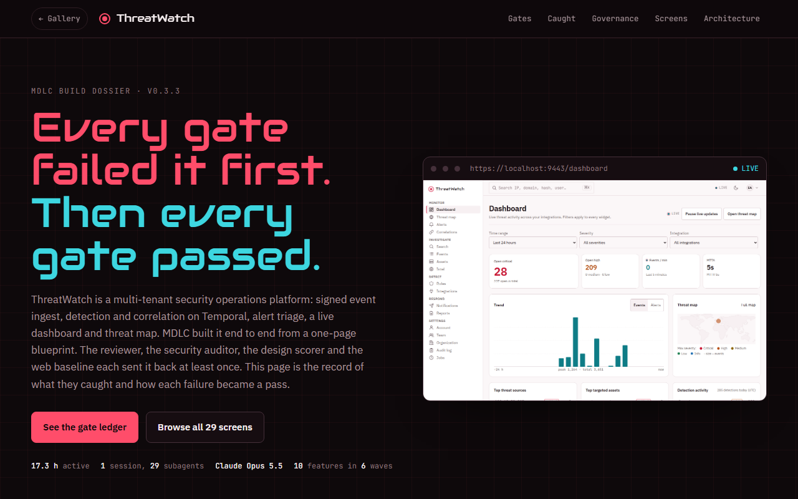

# ThreatWatch

**A multi-tenant security operations platform. Every gate failed it first, then every gate passed.**

[▶ Build dossier](https://mdlcai.github.io/ai-mdlc-kernel-examples/threatwatch/index.html) · [All 29 screens](https://mdlcai.github.io/ai-mdlc-kernel-examples/threatwatch/screens.html) · [System architecture](https://mdlcai.github.io/ai-mdlc-kernel-examples/threatwatch/architecture.html) · [Build with MDLC →](https://mdlc.ai)

> One of twelve reference apps built end-to-end with the **[MDLC](https://mdlc.ai)** methodology, from a `RESEARCH.md` blueprint, through architecture and build, to a passing set of quality gates. Nothing here was hand-tuned after generation.

## What it does

Security teams pipe events in from their integrations over signed webhooks. ThreatWatch normalises them, runs detection rules and correlation on Temporal, raises alerts, and routes them to triage, email and outbound webhooks. A live dashboard, threat map, search, audit log and per-organisation settings sit on top. Every tenant is isolated: another organisation's resources return 404.

## Why it has a dossier

Each gate sent this build back at least once, and none of their thresholds moved:

| Gate | Runs in order | What sent it back |
|------|---------------|-------------------|
| Reviewer | FAIL, FAIL, PASS, PASS, PASS | Pagination cursor 500s, polling instead of live push, job tests asserting counts not effects, then an idempotency fix that regressed |
| Security | FAIL, FAIL, PASS | Stale base-image CVEs, webhook SSRF open to DNS rebinding, credential forms without `method="post"` |
| Design | 7 ✗, 1 ✗, PASS | A 14,708 px tall tile on mobile, IP addresses split mid-octet, header drift |
| Web baseline | 9 FAIL, then PASS | React hydration mismatch, motion under reduced-motion, prohibited ARIA on 26 skeletons; performance held at its floor of 80 |

Twelve of 23 changes touched authentication, authorisation or the security boundary and waited for human approval. When the build tried to commit its own governance ledger, the guard refused it as audit tampering.

## Built from a blueprint

| Stage | Artifact | What it is |
|-------|----------|------------|
| 1 · Research | [`RESEARCH.md`](RESEARCH.md) | Product vision, 12 workflows, threat model, GO decision |
| 2 · Architecture | [`ARCHITECTURE.md`](ARCHITECTURE.md) · [`architecture.html`](https://mdlcai.github.io/ai-mdlc-kernel-examples/threatwatch/architecture.html) | System design and 43 invariants, each tied to its proof |
| 3 · Contract | [`SPEC.md`](SPEC.md) · [`DECISIONS.md`](DECISIONS.md) | 29 screens, 78 endpoints, 32 ADRs |
| 4 · Assurance | [`COMPLIANCE.md`](COMPLIANCE.md) · [`evidence/`](evidence/) | Control mapping, 5 reviewer rounds, 3 security passes, 3 design scorings |
| 5 · Governance | [`GOVERNANCE-DECISIONS.jsonl`](GOVERNANCE-DECISIONS.jsonl) | 40 append-only decision records, 12 human approvals |
| 6 · Build report | [`REPORT.md`](REPORT.md) | Every gate, every run, smoke log and usage receipt |

## The gates it passed

Straight from [`REPORT.md`](REPORT.md):

- **403 / 403** server tests, **15 / 15** web tests, **42 / 42** end-to-end, coverage **93.29%**
- **24 / 24** smoke flows against the live stack over HTTPS
- **43** invariants: 42 machine-proven, 1 manual PASS
- Web baseline: **145** cells (29 screens × 3 widths × 2 themes), Lighthouse accessibility **100**
- Compliance **50 ✓ / 1 ⚠ / 0 ✗**
- Built in **17.3 active hours** on Claude Opus 5.5, one session plus 29 subagents

## Stack

`Next.js 16` · `React 19` · `Express 5` · `Temporal` · `Prisma` · `PostgreSQL 17` · `Caddy` · `Docker Compose`

---

*This folder ships the dossier, the screen atlas and the build's evidence pack. The build runs locally only; there is no public deployment. The runnable source lives in the build, not here.* **[mdlc.ai](https://mdlc.ai)**
