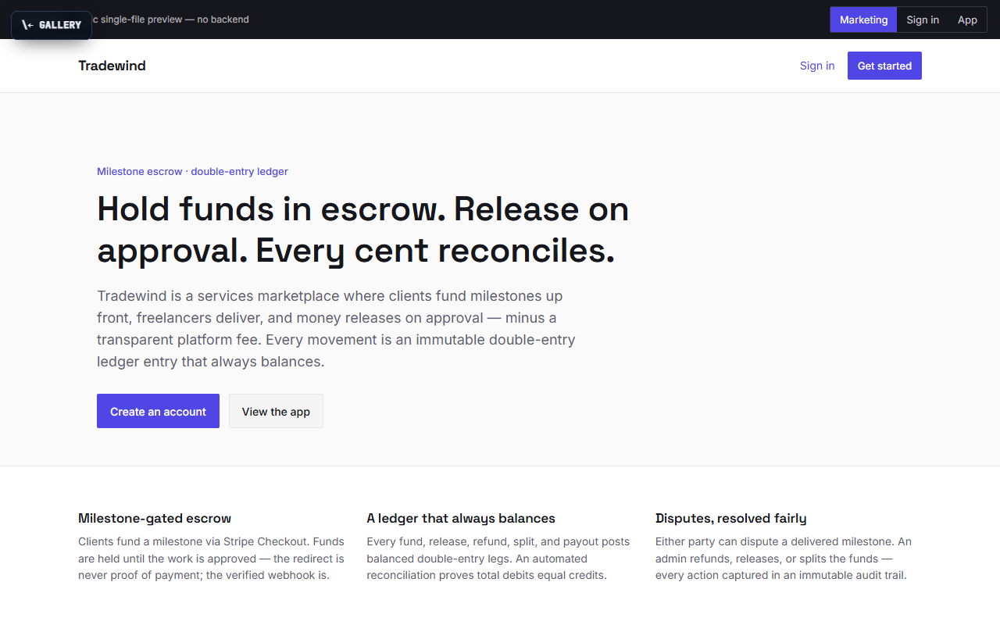

# Tradewind

**Hold funds in escrow. Release on approval. Every cent reconciles.**

[▶ Live preview](https://mdlcai.github.io/ai-mdlc-kernel-examples/tradewind/index.html) · [System architecture](https://mdlcai.github.io/ai-mdlc-kernel-examples/tradewind/architecture.html) · [Build with MDLC →](https://mdlc.ai)

> One of eleven reference apps built end-to-end with the **[MDLC](https://mdlc.ai)** methodology — from a `RESEARCH.md` blueprint, through architecture and build, to a passing set of quality gates. Nothing here was hand-tuned after generation.

## What it does

Tradewind is a multi-vendor services marketplace with **milestone escrow**. A client funds a milestone up front via Stripe Checkout; the money is held until the work is approved; on release it pays out to the freelancer minus a transparent platform fee. Either party can open a dispute, which an admin resolves by refund, release, or split. Every single money movement — fund, release, refund, split, payout — posts as an **immutable double-entry ledger** entry whose legs sum to zero, and an automated reconciliation job proves the closed system always nets to `0`.

## Built from a blueprint

Every file below was generated in sequence. Read them in order to see the methodology work:

| Stage | Artifact | What it is |
|-------|----------|------------|
| 1 · Research | [`RESEARCH.md`](RESEARCH.md) | Product vision, users, threat model, GO/NO-GO |
| 2 · Architecture | [`ARCHITECTURE.md`](ARCHITECTURE.md) · [`architecture.html`](https://mdlcai.github.io/ai-mdlc-kernel-examples/tradewind/architecture.html) | System design, escrow state machine, ledger model |
| 3 · Contract | [`SPEC.md`](SPEC.md) · [`DECISIONS.md`](DECISIONS.md) | API surface + the ADRs behind every choice |
| 4 · Assurance | [`COMPLIANCE.md`](COMPLIANCE.md) · [`SECURITY-AUDIT.md`](SECURITY-AUDIT.md) | PCI-DSS / SOC2 mapping + adversarial security review |
| 5 · Build report | [`REPORT.md`](REPORT.md) · [`SMOKE-TEST.md`](SMOKE-TEST.md) | Every gate that ran + the functional smoke matrix |

## The gates it passed

Straight from [`REPORT.md`](REPORT.md):

- **29 / 29** tests green — money math, ledger Σ=0, idempotency, escrow lifecycle, payout paid/failed/insufficient, disputes, **concurrent approve/payout races**, and cross-user + sub-resource IDOR
- **17 / 17** functional smoke flows PASS — fund → release → payout → reconcile, exercised end-to-end against the running stack
- **12** invariants, 0 failing (8 machine-checked + 4 manually verified) — including INV-2 *no money value is ever a float*, INV-7 *every transaction's legs sum to zero*, and INV-12 *the closed system nets to zero*
- **Security audit: PASS** — 0 critical / 0 high. Stripe webhooks HMAC-verified **before any DB read** and replay-safe (UNIQUE event id); same-tenant cross-user IDOR closed (`assertResourceAccess` on every sub-resource); card data never crosses into the app (Stripe hosted Checkout → **PCI SAQ-A**); real CVEs found and remediated, build-time-only residuals deferred with written rationale
- **Reviewer Gate: PASS** — an independent fresh-context pass caught a spec/code hash-algorithm mismatch and missing Dockerfiles; both reconciled, suite re-run green

## Stack

`Next.js` · `Express` · `PostgreSQL` · `Prisma` · `Stripe` · `Docker Compose`
Domain signals: `has_payments` · `has_webhooks` · `has_dual_write`

---

*This folder ships the standalone preview + the build's evidence pack. The runnable application source lives in the build, not here.* **[mdlc.ai](https://mdlc.ai)**
