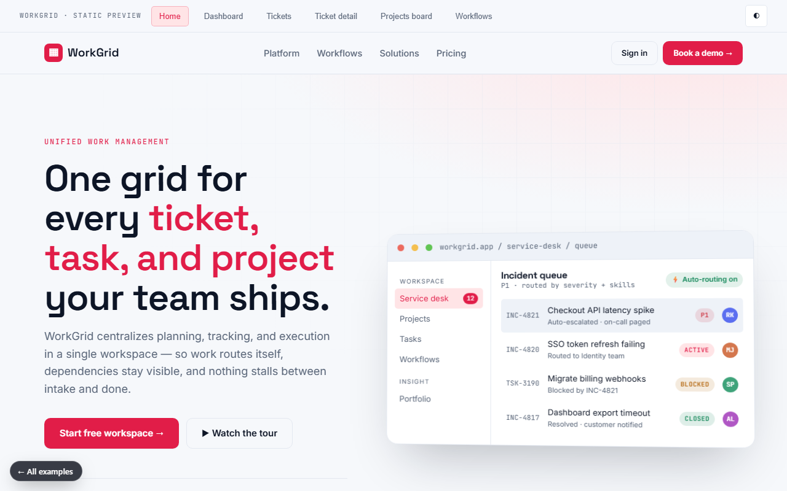

# WorkGrid

**One workspace to move work forward — tickets, tasks, and projects on a single grid.**

[▶ Live preview](https://mdlcai.github.io/ai-mdlc-kernel-examples/workgrid/index.html) · [System architecture](https://mdlcai.github.io/ai-mdlc-kernel-examples/workgrid/architecture.html) · [Build with MDLC →](https://mdlc.ai)

> One of six reference apps built end-to-end with the **[MDLC](https://mdlc.ai)** methodology — from a `RESEARCH.md` blueprint, through architecture and build, to a passing set of quality gates. Nothing here was hand-tuned after generation.

## What it does

A single platform for planning, tracking, and executing team work — **tickets, tasks, and projects in one grid** — that replaces the spreadsheet/email/chat sprawl. Work routes itself, dependencies stay visible, and real-time dashboards keep nothing stalled between intake and done.

## Built from a blueprint

Every file below was generated in sequence. Read them in order to see the methodology work:

| Stage | Artifact | What it is |
|-------|----------|------------|
| 1 · Research | [`RESEARCH.md`](RESEARCH.md) | Product vision, users, threat model, GO/NO-GO |
| 2 · Architecture | [`ARCHITECTURE.md`](ARCHITECTURE.md) · [`architecture.html`](https://mdlcai.github.io/ai-mdlc-kernel-examples/workgrid/architecture.html) | System design, data flow, layer-by-layer |
| 3 · Contract | [`SPEC.md`](SPEC.md) · [`DECISIONS.md`](DECISIONS.md) | API surface + the ADRs behind every choice |
| 4 · Assurance | [`COMPLIANCE.md`](COMPLIANCE.md) | OWASP-aligned controls mapping |
| 5 · Build report | [`REPORT.md`](REPORT.md) | Every gate that ran, with evidence |

## The gates it passed

Straight from [`REPORT.md`](REPORT.md):

- **15 / 15** end-to-end smoke flows PASS
- **13 / 13** machine-checked invariants
- Clean `typecheck` · `lint` · `build` · invariant-lint — all exit 0

## Stack

`Next.js` · `NestJS` · `Postgres` · `REST` · `Docker Compose`
Domain signals: `has_webhooks` · `has_websocket` · `has_dual_write`

---

*This folder ships the standalone preview + the build's evidence pack. The runnable application source lives in the build, not here.* **[mdlc.ai](https://mdlc.ai)**
